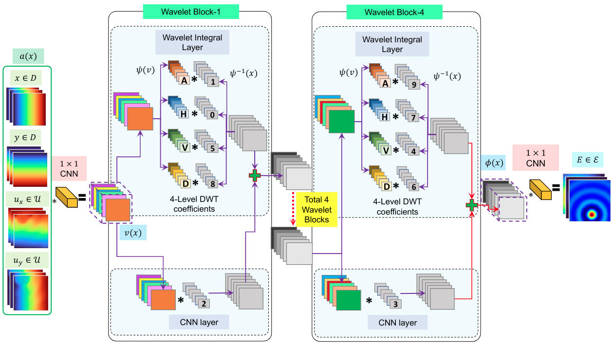

# Wavelet-Neural-Operator-Elastography for Medical Imaging
This repository contains the python codes of the paper 
  > + "A wavelet neural operator based elastography for localization and quantification of tumors", authored by Tapas Tripura, Abhilash Awasthi, Sitikantha Roy, and Souvik Chakraborty.

# Architecture of the wavelet neural operator elastography (WNO-elastography). 

# Files
A short despcription on the files are provided below for ease of readers.
  + `wnoe_(...).py`: The files with this type of names are the main code.
  + `WNOE_testing_(...).py`: The codes with this type of names are used to perform predictions on new inputs.
  + `utilities3.py` contains some useful functions (taken from [FNO paper](https://github.com/zongyi-li/fourier_neural_operator)).

# Library support
Following packages are required to be installed to run the above codes:
  + [PyTorch](https://pytorch.org/)
  + [PyWavelets - Wavelet Transforms in Python](https://pywavelets.readthedocs.io/en/latest/)
  + [Wavelet Transforms in Pytorch](https://github.com/fbcotter/pytorch_wavelets)

# Dataset and pretrained models
  + The training and testing datasets used in the paper are available in the following link:
    > [Dataset](https://drive.google.com/drive/folders/1AnH7l9oeOgoLdZiIl5YDmyomZX-0_QPA?usp=sharing) 

For performing predictions on new inputs, one can use the 'WNOE_testing_(...).py' codes. The pretrained models can also be found in the above link.

Keep all the data in the folder named 'data' and place the folder 'data' inside the same mother folder where the codes are present.	Incase, the location of the data are changed, the correct path should be given.
